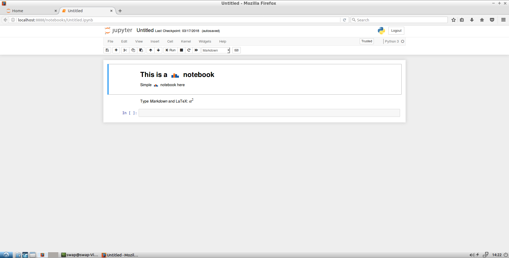

SWAN REPLACEMENT EXTENSION
-------------------------------------------
Hi, to use this nbextension,

1)first install it with the command:

`$ jupyter nbextension install path/to/extension_folder - -user`

2)and then enable it with the command:

`$ jupyter nbextension enable extension_folder/main - -user`

then you may use the extension on any notebook cell at anytime.

Expected usage:

Before:

After:

Thank you for using this tool. 
